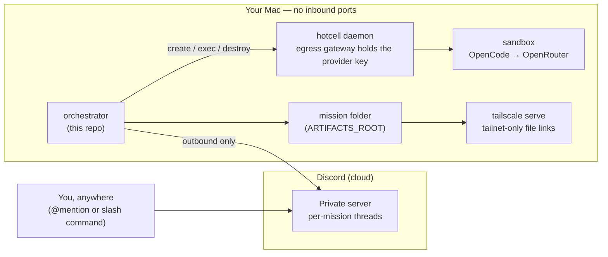

# groundcontrol

Turn a spare Mac into a private agent server you command from Discord.
`@mention` an agent bot in your own server and an orchestrator on your Mac
spins up an isolated [hotcell](https://github.com/sinameraji/hotcell) sandbox,
runs OpenCode headlessly via OpenRouter (Kimi K2.5 by default), and reports
back in a per-mission Discord thread — a PR link for coding missions, a
private tailnet file link for research missions. The thread keeps its sandbox
between messages (auto-paused when idle), so replies pick up right where the
agent left off. No inbound ports, no keys in sandboxes, no public artifacts.

## Architecture

## Why this shape

- **No inbound ports.** The bot connects *out* to Discord's gateway; nothing
  on the Mac listens to the internet.
- **Provider keys never enter sandboxes.** hotcell's egress gateway proxies
  OpenRouter traffic; the sandbox only ever holds a short-lived `hc-…` token.
- **GitHub credentials never enter sandboxes.** Work leaves the sandbox as a
  git bundle; the *host* pushes the branch and opens the PR with its own
  authenticated `gh`.
- **Artifact links are tailnet-only.** The file server binds `127.0.0.1` and
  is exposed only via Tailscale Serve — links work on your devices, nowhere
  else.
- **Owner-id gate.** Only your Discord user id is obeyed; bot-authored
  messages are ignored (no bot loops).
- **Spend caps, timeouts, admission control.** A runaway agent burns its
  per-mission cap (default $5), hits the mission timeout (default 45 min),
  or is refused a sandbox when the host is out of memory budget.

## Quick start

1. Prereqs: `brew install node gh` (then `gh auth login`), Docker via
   `brew install colima docker && colima start`, and `npm i -g hotcell`.
2. `git clone https://github.com/sinameraji/groundcontrol && cd groundcontrol`
3. `npm install`
4. Create one Discord application per agent and invite the bots to your
   private server — full walkthrough in [ops/setup.md](ops/setup.md).
5. `cp .env.example .env` and fill in the tokens and ids.
6. `cp config/agents.example.json config/agents.json` and tweak names/personas.
7. `hotcell start` then `hotcell keys add openrouter` (paste your OpenRouter
   key — it lives in the macOS keychain, never in a sandbox).
8. `npm run register` — registers the slash commands with Discord.
9. `npm run dev` — bots come online.
10. In your server: `@codey add rate limiting to https://github.com/you/api`
    and watch the thread.

## Going 24/7

Run `ops/install.sh` to install launchd agents for the orchestrator, the
hotcell daemon, and a weekly janitor — they start at login and restart on
crash. The full runbook (Tailscale Serve, external drive, keep-awake and
battery settings) is in [ops/setup.md](ops/setup.md).

## Commands

| Command | Agent | What happens |
|---|---|---|
| `@codey <task> <repo url>` | coding | sandbox → OpenCode → git bundle → host opens a PR |
| `@scout <question>` | research | sandbox → report + artifacts → private tailnet links |
| `/code` | coding | same as the mention, as a slash command |
| `/research` | research | same as the mention, as a slash command |
| `/status` | any | active + queued missions |
| `/cancel` | any | cancel a queued or running mission by id |

## Conversations

Each Discord thread keeps **one persistent sandbox** — its *cell*. Reply in a
thread and the agent picks up where it left off: the repo clone, past reports,
and any notes it made are still in the workspace, and recent thread messages
are fed into the prompt, so follow-ups ("now compare that against X") resolve
their references.

Idle cells auto-pause after `SANDBOX_SLEEP_AFTER_MINUTES` (default 2) at
~zero RAM, then transparently resume when you return — even weeks later. The
weekly janitor destroys cells idle longer than `CELL_MAX_IDLE_DAYS` (default
30), workspace included; after that the thread simply starts a fresh cell.
Both variables are in `.env.example`.

One budget note: the egress spend cap is per **sandbox**, so
`MISSION_SPEND_CAP_USD` is the whole conversation's budget, not one
message's — a long-running thread spends against a single cap until its cell
is destroyed.

## Costs

The default model is Kimi K2.5 via OpenRouter — roughly **$0.57/M input**
and **$2.85/M output** tokens at time of writing, so typical missions cost
cents. Every mission has a hard egress spend cap (`MISSION_SPEND_CAP_USD`,
default **$5**) enforced by hotcell's gateway, so the worst case is bounded.
The LLM runs on OpenRouter's side; your Mac just orchestrates.

## Roadmap

- **v2 — agent handoffs**: agents read each other's mission folders and hand
  off work (`@codey` builds what `@scout` researched), with a hop cap and the
  same per-mission spend caps. The mission-folder-per-task, thread-per-mission,
  bot-identity-per-agent structure in v1 is exactly the rails this needs.

## License

[Apache-2.0](LICENSE)
